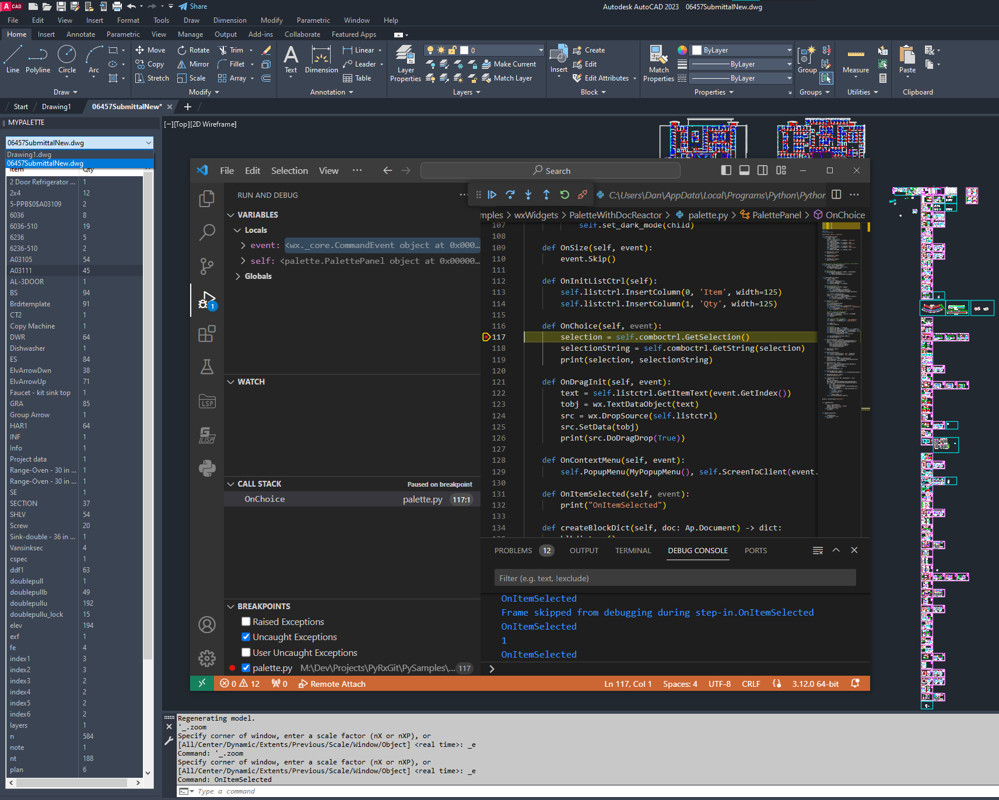

[](https://www.python.org/downloads/release/python-312/)
[](https://www.gnu.org/licenses/lgpl-3.0)
[](https://pypi.org/pypi/cad-pyrx/)
[](https://github.com/CEXT-Dan/PyRx/actions/workflows/mypy-check.yml)
[](https://github.com/CEXT-Dan/PyRx/actions/workflows/pytest-check.yml)
[](https://github.com/CEXT-Dan/PyRx/actions/workflows/ruff-check.yml)
# Python for AutoCAD 

Visit us on [PyPi](https://pypi.org/project/cad-pyrx/).  View the [Change Log](https://github.com/CEXT-Dan/PyRx/blob/main/CHANGE_LOG.md)

PyRx provides Python bindings for CAD software:

**C++ bindings**:

- **AutoCAD®**: ObjectARX® 2021-2026
- **ZwCAD®**: ZRX® 2024-2026
- **GstarCAD®**: GRX® 2024-2026
- **BricsCAD®**: BRX® v24.2-v25.2

**ActiveX bindings**:

- **AutoCAD®**: 2021-2026
- **BricsCAD®**: v24.2-v25.2
- **GstarCAD®**: 2024-2026
- **ZwCAD®**: 2024-2026

_This project will not work for AutoCAD LT or BricsCAD Lite, check that your CAD can load ARX Modules first._
_Wherever in this project we talk about AutoCAD, we mean all supported applications (BricsCAD, GstarCAD, ZwCAD), and when we talk about ARX (Object ARX), we also mean BRX, GRX and ZRX._

Uses wxPython for the GUI, dialogs, and CAdUiPalette wrapper.
Embeds Python (3.12) and wxPython (4.2.3) into a loadable ARX module.

## Installation

Installing from the from Microsoft Store is currently not supported

Watch the Youtube [video](https://www.youtube.com/watch?v=MrQ7N2WulI4)

Install [python 3.12.X](https://www.python.org/downloads/windows/) (64 bit) with the :exclamation:PATH checkbox:exclamation: set to true:

,

Install PyRx from [PyPI](https://pypi.org/project/cad-pyrx):

```bash
pip install cad-pyrx
```

Use ``APPLOAD`` command or the startup suite to load PyRx in CAD application, example:
Note: if you are using a VENV, this path may differ, it will be loacated where you installed it

```raw
_APPLOAD
%localappdata%\Programs\Python\Python312\Lib\site-packages\pyrx\RxLoaderZ25.0.zrx
or
RxLoader24.0.arx = 2021
RxLoader24.1.arx = 2022
RxLoader24.2.arx = 2023
RxLoader24.3.arx = 2024
RxLoader25.0.arx = 2025
RxLoader25.1.arx = 2026
RxLoaderV25.0.brx = BricsCAD v25
```
You should now be able to load modules with the new PYLOAD command

AutoCAD users may optionally install a .bundle using the MSI installer attached to the [release](https://github.com/CEXT-Dan/PyRx/releases)

## Other ways to get the package:

Install PyRx from the latest commit:

```bash
python -m pip install git+https://github.com/CEXT-Dan/PyRx.git
```

## Uninstall:

```bash
python -m pip uninstall cad-pyrx
```
## Share

Need to share your project? Have a look at this project [here](https://github.com/gswifort/PyRx-sample-project)

## Commands

When loading the ARX/BRX/GRX/ZRX module, the following commands are added to CAD application:

- **PYLOAD**: Use this command to load your Python modules
- **PYRELOAD**: Use this command to reload your Python modules
- **PYDEBUG**: Starts debugpy adapter, for debugging your code 
- **PYCMDPROMPT**: Provides simple access to the python interpreter
- **PYRXVER**: Prints the ARX module version
- **PYRXLOADLOG**: Prints the ARX module load logs
- **PYPIP**: List, install, or uninstall Python packages 

**Autolisp commands:**  
``(adspyload PATH)`` returns T or nil  
``(adspyreload PATH)`` returns T or nil  
``(adspyloaded)`` returns a list of loaded modules  

## ARX sample

```py
from pyrx import Rx, Ge, Gi, Db, Ap, Ed, Sm
import traceback

 # these four (Optional) functions are called as they would be in ARX
def OnPyInitApp():
    print("\nOnPyInitApp")
    print("\ncommand = pydoit")

def OnPyUnloadApp():
    print("\nOnPyUnloadApp")

def OnPyLoadDwg():
    print("\nOnPyLoadDwg")

def OnPyUnloadDwg():
    print("\nOnPyUnloadDwg")

 # function decorator adds AutoCAD commands
@Ap.Command()
def doit():
    try:
        db = Db.HostApplicationServices().workingDatabase()

        # create a line
        line = Db.Line()
        line.setDatabaseDefaults()

        # use Ge point
        line.setStartPoint(Ge.Point3d(0, 0, 0))
        line.setEndPoint(Ge.Point3d(100, 100, 0))

        # set a color
        color = Db.Color()
        color.setRGB(255, 255, 0)
        line.setColor(color)

        # open modelspace for write and add the entity
        model = Db.BlockTableRecord(db.modelSpaceId(), Db.OpenMode.ForWrite)
        model.appendAcDbEntity(line)

    except Exception:
        traceback.print_exc()
```

## ActiveX sample

```py
from pyrx import Rx, Ge, Gi, Db, Ap, Ed, command

 # function decorator with try catch adds AutoCAD commands
@command
def xdoit():
    # get the application, document and modelspace
    axApp = Ap.Application.acadApplication()
    axDoc = axApp.activeDocument()
    axModel = axDoc.modelSpace()

    # add a circle
    axCircle = axModel.addCircle(Ge.Point3d(0, 0, 0), 5)
    print(axCircle.diameter())

    # add a line
    axLine = axModel.addLine(Ge.Point3d(0, 0, 0), Ge.Point3d(100, 0, 0))
    print(axLine.length())

    # add a lwpline
    pnts = [
        Ge.Point2d(0, 0),
        Ge.Point2d(100, 0),
        Ge.Point2d(100, 100),
        Ge.Point2d(0, 100),
    ]
    axPline = axModel.addLightWeightPolyline(pnts)
    axPline.setClosed(True)
    print(axPline.isClosed())

```

**and many more examples**: <https://github.com/CEXT-Dan/PyRx/tree/main/PySamples>

## Features

- Create GUIs with wxPython, bindings for dialogs and palettes

    

- Generated stub files for built in help, autocomplete

    

- Debugging support with debugpy

    

## Contributing

Interested in making contributions to this project? Please review the guide below.

[Contributing Guidelines](https://github.com/CEXT-Dan/PyRx/blob/main/CONTRIBUTING.md)

## See also

- [Blogs](https://pyarx.blogspot.com)
- [Discussion forum](https://www.theswamp.org/index.php?board=76.0)
- [AutoCAD Object Model (AutoLISP/ActiveX)](https://help.autodesk.com/view/OARX/2025/ENU/?guid=GUID-A809CD71-4655-44E2-B674-1FE200B9FE30)
- [ObjectARX Reference Guide](https://help.autodesk.com/view/OARX/2025/ENU/?guid=OARX-RefGuide-ObjectARX_Reference_Guide)
